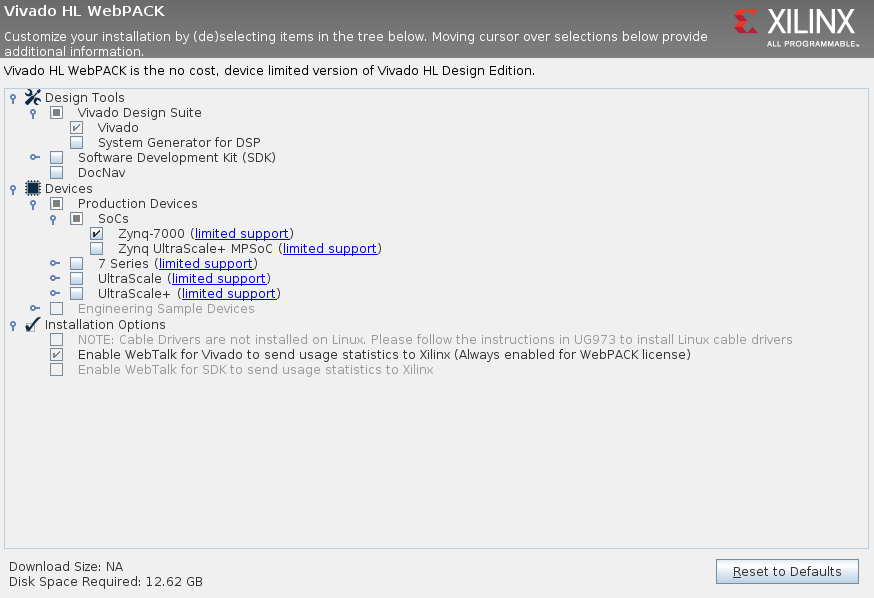
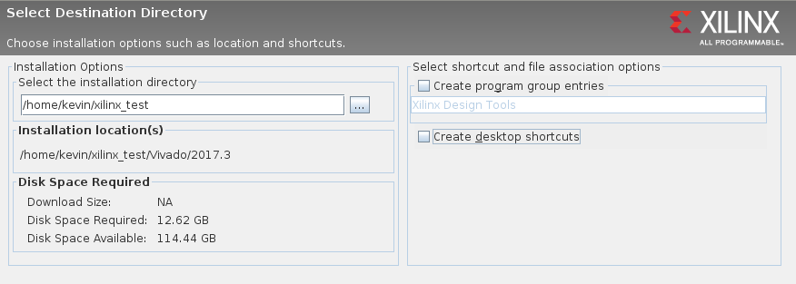
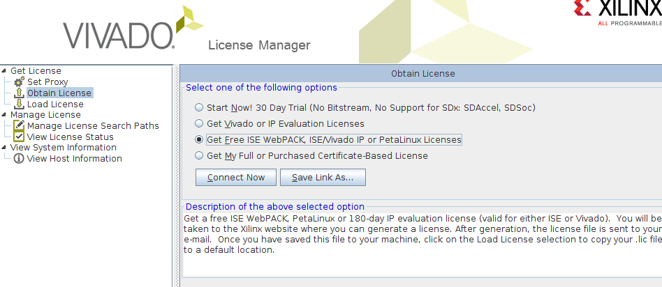

# System Setup

## Chisel

[Chisel](https://chisel.eecs.berkeley.edu/)
is a Domain Specific Hardware Description Language developed at UC Berkeley.
It is embedded in [Scala](https://www.scala-lang.org/) which uses the
[sbt](https://www.scala-sbt.org/) build tool and package manager to manage
dependencies.

### Install sbt

`sbt` automatically downloads everything you need, including the exact version
of `sbt` itself that you need for the project.
Thus the only thing you need for `Chisel` and `Scala` is to install`sbt`.
Follow the instructions in the
[official installation guide](https://www.scala-sbt.org/1.x/docs/Installing-sbt-on-Linux.html).

### Install Verilator

In order to simulate the low level [Verilog](https://en.wikipedia.org/wiki/Verilog)
code generated by `Chisel` you need the open source circuit simulator
[verilator](https://www.veripool.org/projects/verilator).
At least version `3.886` is required.
On Fedora 27, you can install version `3.890` from the default repositories.
On a recent [Ubuntu 17.04](https://packages.ubuntu.com/zesty/verilator)
or [Ubuntu 17.10](https://packages.ubuntu.com/artful/verilator) version `3.9`
is available from the default repositories.

If your distribution does not offer a recent version of `verilator`,
you can compile it yourself by following the
[Chisel Readme](https://github.com/freechipsproject/chisel3#ubuntu-like-linux).

### Test your Installation

You can test your installation by running the `chisel` tests:

1. change to the `chisel` directory in this repository: `> cd chisel`
2. launch `sbt`: `> sbt`
3. once `sbt` is booted, run the tests: `sbt:queue> test`
4. The first test `(with firrtl)` should succeed if you have installed `sbt` and
   `Chisel` is able to run on your system correctly.
5. The second test `(with verilator`) will succeed if your `verilator` installation
   is working.

## Vivado

We recommend using version `2017.3` which can be [downloaded directly from
Xilinx](https://www.xilinx.com/support/download/index.html/content/xilinx/en/downloadNav/vivado-design-tools/2017-3.html).
Use the `All OS installer Single-File Download` which has proven to be reliable.

### Install Vivado

In the explaination below we assume that you want to install Vivado into a
user writable directory instead of a system directory.
We use `/home/kevin/xilinx_test` as the example path.
If you want to install to e.g. `/opt`, you need to launch `xsetup` with `sudo`.

1. extract the Vivado files: `tar -xf Xilinx_Vivado_SDK_2017.3_1005_1.tar.gz`
2. change into the extracted directory and launch `./xsetup`
3. click `next`
4. accept all three license agreements and click `next`
5. select `Vivado HL WebPack` (this is the free - as in beer - version) and click `next`
6. we only need `Vivado` and `Zynq-7000` support:

7. click `next`
8. select the installation directory. We recommend to deselect all shortcut options on the right:

9. review your selection and install
10. wait until you see the `Installation completed successfully.` promt.

### Install Board File

By default, Vivado does not know about the `PYNQ` board that we are using.
Luckily, `digilent` provides a board description file for the very similar
`arty-z7-20` board.

1. Checkout the `digilent` board files repository: `git clone https://github.com/Digilent/vivado-boards.git`
   Alternatively you can download and extract the ZIP file: `wget https://github.com/Digilent/vivado-boards/archive/master.zip`
2. Copy the `arty-z7-20` board file into your Vivado installation, e.g.: `cp new/board_files/arty-z7-20 /home/kevin/xilinx_test/Vivado/2017.3/data/boards/board_files -r`

### Request and Install a Vivado License

To be able to use Vivado, a free (as in beer) license needs to be requested using
a Xilinx account and then installed.

1. Launch Vivado: `source /home/kevin/xilinx_test/Vivado/2017.3/settings64.sh && vivado`
2. Launch the `License Manager` by clicking on `Help -> Manage License`
3. Got to the `Optain License` tab, select `Get Free WebPack [...]` and click on `Connect Now`

4. If this does not work, try `Save Link As` and manually navigate to the website.
5. Follow the instructions on the Xilinx website to optain a `Xilinx.lic` file.
6. Go to the `Load License` tab and click on `Copy License`.
7. Navigate to the `Xilinx.lic` file that you downloaded in step 5 and select it.
8. After the success promt, you can exit the `License Manager` and then exit the Vivado GUI.

### Test your Installation

This requires that you have installed and tested `Chisel`.

1. change to the `chisel` directory in this repository: `> cd chisel`
2. launch `sbt`: `> sbt`
3. once `sbt` is booted, generate the low level `Verilog` in `chisel/ip`: `sbt:queue> run`
4. quit `sbt`
5. change to the root directory in this repository: `> cd ..`
6. load Vivado: `source /home/kevin/xilinx_test/Vivado/2017.3/settings64.sh`
7. synthesize the example design and generate the bitstream: `make`
8. if this succeeds, your `Vivado` and `Chisel` installation are working

## Rust

In order to control the circuits on the FPGA, we will use the modern
systems programming language [Rust](https://www.rust-lang.org/).
Compared to `C`, `Rust` offers modern programming features such as
[traits](https://doc.rust-lang.org/book/second-edition/ch10-02-traits.html),
[pattern matching](https://doc.rust-lang.org/book/second-edition/ch06-02-match.html),
[a module system](https://doc.rust-lang.org/book/second-edition/ch07-00-modules.html),
[a collections library](https://doc.rust-lang.org/book/second-edition/ch08-00-common-collections.html)
and much more.
Whereas a lot of programs written in `C` or `C++` suffer from memory errors,
the `Rust` compiler can prove at compile time, that our code is free of these
errors.
`Rust` is a better fit for system programming compared to `Python` or
`Java`, since it compiled into a single static binary without any
complicated runtime requirements (such as a garbage collector).

### RustUp

The recommended way of installing rust is to use the `rustup` tool.
Just follow their [installation instructions](https://github.com/rust-lang-nursery/rustup.rs/#other-installation-methods).

### Cross Compile Toolchain

We will be targeting the `ARMv7` core on the `Zynq` chip to run our program on.
For this purpose we need to install a rust toolchain that compile to this
target:

```
> rustup target add armv7-unknown-linux-gnueabihf
```

This installs the rust compiler for the `armv7` target, however,
we still need a linker. For this purpose you need to install
the `gcc` cross compile toolchain for this target.

On Fedora you can find a [compatible toolchain on copr](https://copr.fedorainfracloud.org/coprs/lantw44/arm-linux-gnueabihf-toolchain/).
On Ubuntu you can just install the `gcc-arm-linux-gnueabihf` package.

More details are explained in [this readme](https://github.com/japaric/rust-cross#tldr-ubuntu-example),
but please be aware that creating a `.cargo` configuration is **not** needed
since we include a local version in this repository.

### Test your Installation

To test whether your `Rust` installation can cross compile our code:

1. change to the `control` directory in this repository: `> cd control`
2. build the application: `> cargo build --target=armv7-unknown-linux-gnueabihf`
3. make a release build: `> cargo build --target=armv7-unknown-linux-gnueabihf --release`
4. if there are no error, you are ready to test the application on the FPGA
